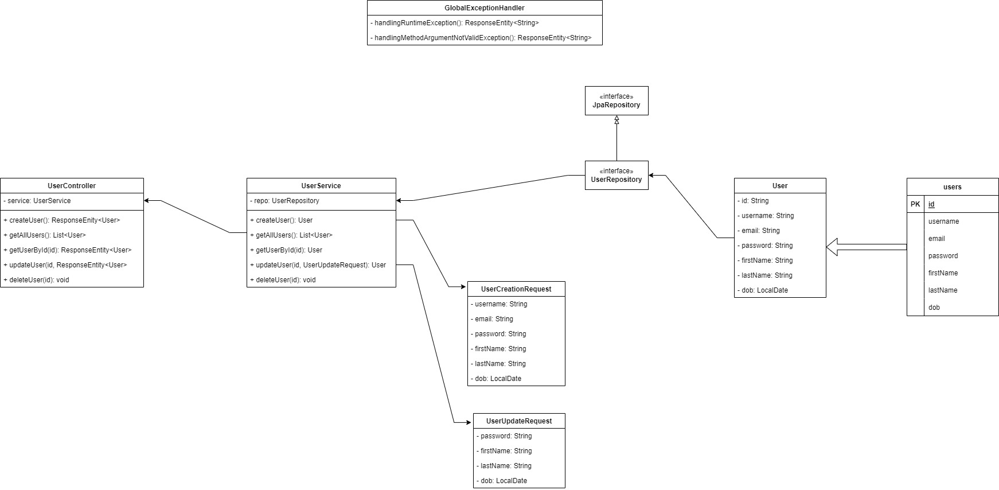

# Basic Exception Handling and Validation

## Sơ đồ




## Các exceptions có thể xảy ra


### Trùng `username` trong khi khởi tạo mới một `user`.

```java
if (userRepository.existsByUsername(request.getUsername())) {
        throw new RuntimeException("Username existed.");
    }
```

### Trùng `email` trong khi khởi tạo mới `user`.

```java
if (userRepository.existsByEmail(request.getEmail())) {
            throw new RuntimeException("Email existed.");
        }
```

### Không tìm thấy `User`

`userId` nhập vào để tìm kiếm trong database không tồn tại -> không tìm thấy `user`:

```java
public User getUserById(String userId) {
    return userRepository.findById(userId)
            .orElseThrow(() -> new RuntimeException("User not found."));
}
```


### `username` quá ngắn, dưới 3 kí tự.

```java
public class UserCreationRequest {
    @Size(min = 3, message = "username must be at least 3 characters.")
    private String username;

    // Các field khác
}
```

### `password` quá ngắn, dưới 8 kí tự.

```java
public class UserCreationRequest {

    @Size(min = 8, message = "password must be at least 8 character")
    private String password;

    // Các field khác
}
```

```java
public class UserUpdateRequest {

    @Size(min = 8, message = "password must be at least 8 character")
    private String password;

    // Các field khác
}
```

## Vấn đề

### RuntimeException

Trong một số phương thức mặc dù đã ném ra `RuntimeException` với `message` rõ ràng, tuy nhiên khi thử gửi các request không đúng, respone trả về có nội dung mặc định, không rõ ràng, khiến ta không biết được lỗi ở đâu.

#### Ví dụ

Với phương thức tạo tìm `User` với tham số `id` truyền vào, có thể xảy ra trường hợp `id` không không đúng, dẫn đến `User` không tồn tại.

Mặc dù đã ném ra `RuntimeException` với message là `"User not found."`.

Tuy nhiên khi thử gửi một `id` không đúng:
`localhost:8082/identity/users/2ascasc`

Thì response trả về vẫn chỉ là mặc định, không rõ ràng:
```json
{
    "timestamp": "2024-05-12T15:28:41.055+00:00",
    "status": 500,
    "error": "Internal Server Error",
    "path": "/identity/users/2ascasc"
}
```

Còn message mà ta muốn hiển thị `"User not found."` thì lại xuất hiện ở terminal.

```bash
java.lang.RuntimeException: User not found.
```

### Validation

Trong ví dụ này ta cũng sẽ gặp phải một exception khi thực hiện xác thực.

Khi khởi tạo hoặc thay đổi thông tin `User`, ta cần phải validate thông tin từ các request để đảm bảo đúng với yêu cầu của hệ thống.
Ví dụ: `password` thì cần phải trên 8 kí tự, `username` thì cần phải tối thiểu 3 kí tự, v.v...

#### Ví dụ

Giờ ta thử gửi một request khởi tạo tới `localhost:8082/identity/users`, với mật khẩu ít hơn 8 kí tự:

```json
{
    "username": "user999",
    "password": "1234",
    "firstName": "Jane",
    "lastName": "Smith",
    "dob": "1985-05-15"
}
```

Thì sẽ nhận được respone:
```json
{
    "timestamp": "2024-05-12T16:10:25.724+00:00",
    "status": 400,
    "error": "Bad Request",
    "path": "/identity/users"
}
```

Giống như ở trên, message mà ta muốn hiển thị thì xuất hiện ở terminal:

```bash
WARN 19268 --- [nio-8082-exec-1] .w.s.m.s.DefaultHandlerExceptionResolver : Resolved [org.springframework.web.bind.MethodArgumentNotValidException: Validation failed for argument [0] in public org.springframework.http.ResponseEntity<com.example.basichandlingexceptionvalidation.entity.User> com.example.basichandlingexceptionvalidation.controller.UserController.createUser(com.example.basichandlingexceptionvalidation.dto.request.UserCreationRequest): [Field error in object 'userCreationRequest' on field 'password': rejected value [1234]; codes [Size.userCreationRequest.password,Size.password,Size.java.lang.String,Size]; arguments [org.springframework.context.support.DefaultMessageSourceResolvable: codes [userCreationRequest.password,password]; arguments []; default message [password],2147483647,8]; default message [password must be at least 8 character.]] ]
```

## Giải quyết

Cần phải có một class chuyên xử lý Exception của toàn bộ project với annotation `@ControllerAdvice`.

Ta sẽ tạo ra một package `exception`, trong đó chứa class `GlobalExceptionHandler`:

```java
@ControllerAdvice
public class GlobalExceptionHandler {

}
```

### RuntimeException

Ta thêm function này vào `GlobalExceptionHandler`

```java
    //Xử lý những RuntimeException
    @ExceptionHandler(value = RuntimeException.class)
    public ResponseEntity<String> handlingRuntimeException(RuntimeException exception) {
        return ResponseEntity.badRequest().body(exception.getMessage());
    }
```

#### Giải thích
* Phương thức này trả về một `ResponseEntity`.
* Với các exception xảy ra trong quá trình gửi request, nên sẽ là `badRequest()`.
* Và cuối cùng, ta lấy ra message rồi cho vào phần `body()` của `ResponseEntity` cần trả về.

Thử lại với request `localhost:8082/identity/users/2ascasc`

Khi này kết quả trả về sẽ là message mà ta mong muốn:

```bash
User not found.
```

### Validation:

Trước hết cần phải có dependency của `validation` trong file `pom.xml`:

```xml
<dependency>
    <groupId>org.springframework.boot</groupId>
    <artifactId>spring-boot-starter-validation</artifactId>
</dependency>
```

Thêm annotation `@Valid` vào tham số `request` cần được validate trong class `UserController`:

```java
    //Create
    @PostMapping
    public ResponseEntity<User> createUser(@RequestBody @Valid UserCreationRequest userCreationRequest) {
        User createUser = userService.createUser(userCreationRequest);
        return new ResponseEntity<User>(createUser, HttpStatus.CREATED);
    }

    //Update
    @PutMapping("/{userId}")
    public ResponseEntity<User> updateUser(@PathVariable("userId") String userId, @RequestBody @Valid UserUpdateRequest userUpdateRequest) {
        User updateUser = userService.updateUser(userId, userUpdateRequest);
        return ResponseEntity.ok(updateUser);
    }
```

Quay lại terminal hiển thị lỗi ở trên của validation, ta sẽ đọc được đây là một exception liên quan đến `MethodArgumentNotValidException` (đối số của phương thức không hợp lệ).

```bash
...Resolved [org.springframework.web.bind.MethodArgumentNotValidException:...
```

Tương tự như `RuntimeException` ở trên, ta cũng tạo ra một function vào class `GlobalExceptionHandler`:

```java
    @ExceptionHandler(value = MethodArgumentNotValidException.class)
    public ResponseEntity<String> handlingMethodArgumentNotValidException(MethodArgumentNotValidException exception) {
        return ResponseEntity.badRequest().body(exception.getFieldError().getDefaultMessage());
    }
```

#### Giải thích
* Phương thức này trả về một `ResponseEntity`.
* Với các exception xảy ra trong quá trình gửi request, nên sẽ là `badRequest()`.
* Và cuối cùng, ta lấy ra message rồi cho vào phần `body()` của `ResponseEntity` cần trả về.
* Khác một chút với `RuntimeException`, phần message cần được lấy từ `DefaultMessage` bên trong `FieldError`.

Gửi lại request ở trên và ta có kết quả:

```bash
password must be at least 8 character
```